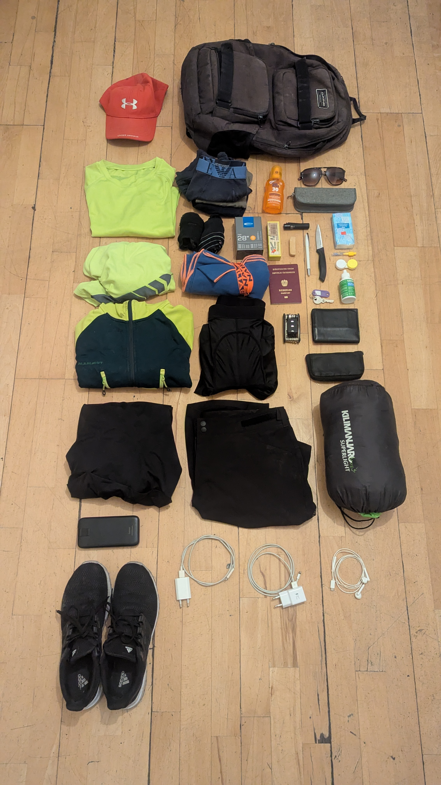
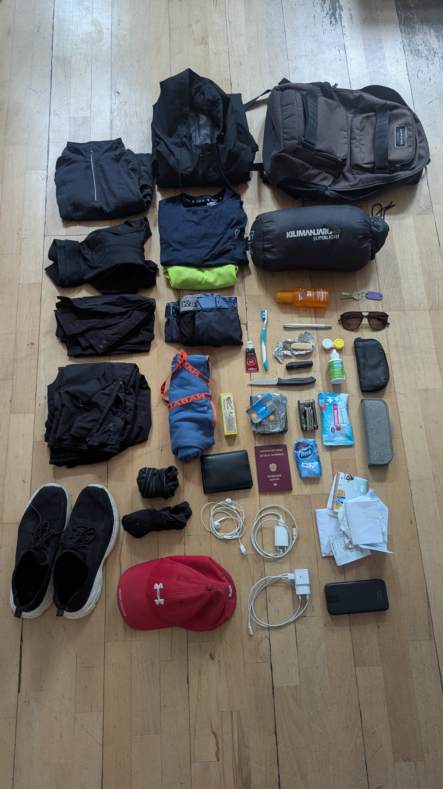

# Reise mit dem Radl von Wien (AT) nach Sarajevo (BIH)

## Plan

- Strecke: 630 km
- Höhenmeter: 3600 hm
- geplanter start: 2026-05-04
- geplantes ende: ca. 2026-05-10

### Route

ca. 100km / tag => ca. 6 tage
100km/d machbar, weil es hat sogar geregnet bei sbg - wien

#### Grob (sehr optimistisch)

- 0. Wien, AT
- 1. Keszthely, HU (218 km)
- 2. Slatina, CRO (150 km)
- 3. Brod, BIH (100 km)
- 4. Zenica, BIH (138 km)
- 5. Sarajevo, BIH (74 km)

#### Feinplanung

Feinplanung mit den kleineren Orten, falls Navi ausfällt, dann via Ortschilder navigieren

- Wien Schönbrunn
  - Eisenstadt
  - Ödenburg (HU)
  - Deutschkreuz
  - Zsira
  - Sarvar
  - Kald
  - Kissomlyo
  - Duka
  - Keled
  - Szalapa
  - Vindornyaszőlős
  - Heviz
- Keszthely
  - Balatonszentgyörgy
  - Somogysámson
  - Nagyszakácsi
  - Tapsony
  - Böhönye
  - Kutas
  - Szabás
  - Nagykorpád
  - Görgeteg
  - Csokonyavisonta
  - Barcs
  - Zrinj Lukački (CRO)
  - Rušani
  - Gradina
  - Cabuna
  - Sladojevci
- Slatina
- Brod
- Zenica
- Sarajevo

#### Rückreise

TBD (am Weg überlegen)

### Wetter

wetter vie

wetter sjj

### Inventar

Stirnlampe wäre noch geil, dann könnte ich auch am abend, bzw. in der Dunkelheit fahren.
Evtl. weiteres Akkupack am Weg kaufen. Platz im Rucksack lassen für Essen.
Schlafsack unten verstauen, weil seltener gebraucht. Bessere Schuhe evtl. unterwegs kaufen.

| vorher                                                                  | nacher                                                                |
| ----------------------------------------------------------------------- | --------------------------------------------------------------------- |
|  |  |

---

## Umsetzung

FUUUUCK oida i kack mi so an aber gleichzeitig freu i mi. HAHA es wird soooo sick!!!!
