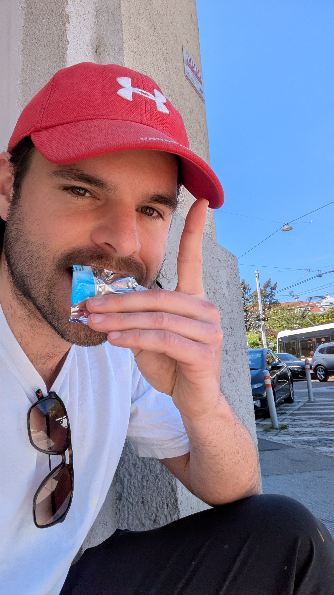
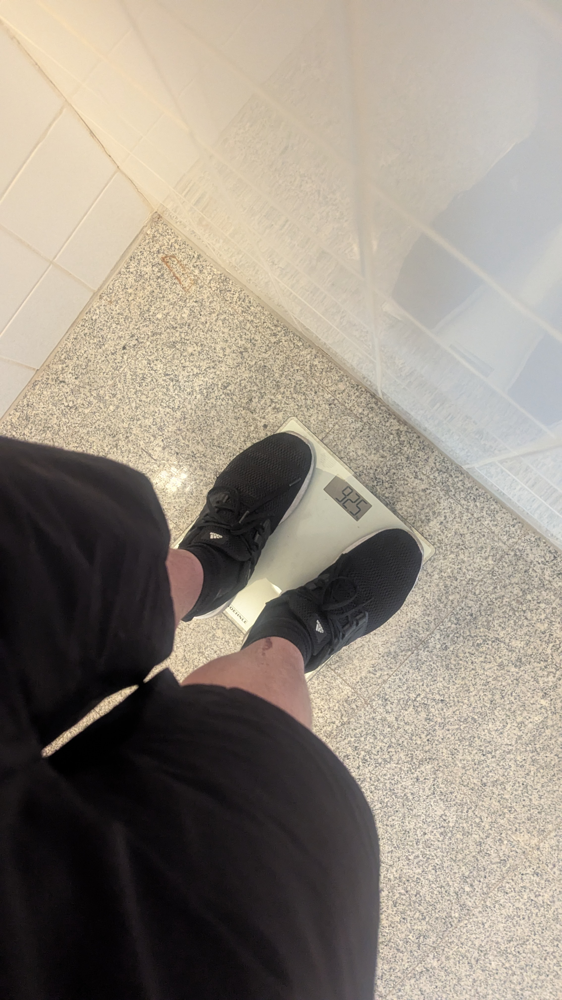
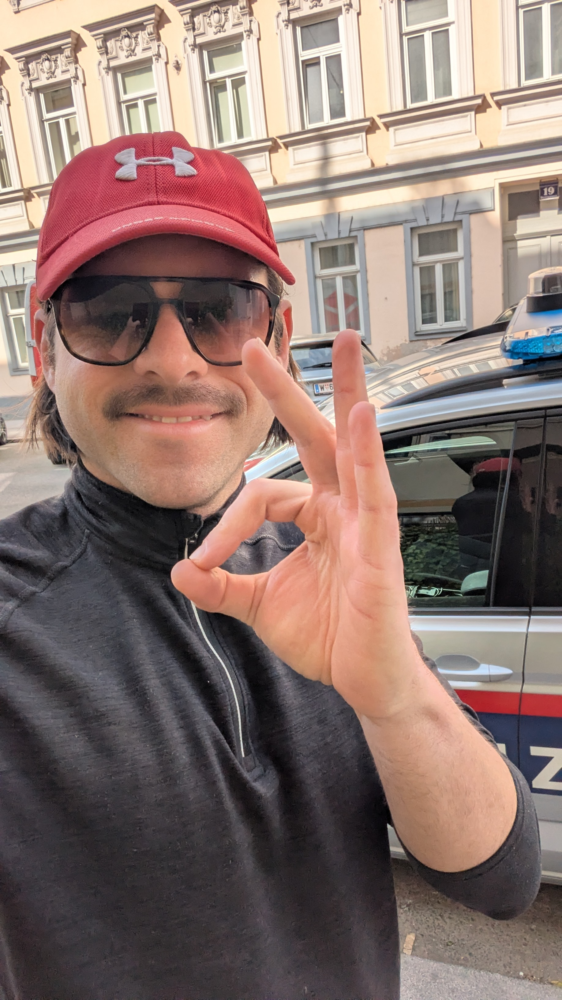

<a href="./plan.md">Check out plan</a>

fuck off oida i brich ab!!
huansohn strecke nur wind, dreck!!
i foa niewieder radl

# Tag 1: 2026-05-04

hab nu auf die Rauchfangkehrer Termin gewartet und rein gelassen. war nach 1min vorbei der Termin komplett useless, aber zum Glück gleich um 8.45 erledigt. Bin dann ca. um 9 los, Wien ist Katastrophe mit den scheiss Ampeln und Navigation chaos... Dauernd bremsen und Beschleunigen.. durchn 10. und dann glei paar mal verfahren, viel Energie und Zeit verschwendet aber habs nach Ungarn geschafft. Aber lang ned so weit wie geplant. Aufjedenfall mehr Zeit fürs reinkommen nächstes mal einplanen. vlt. nur 50km oder so. Hab an einer verlassenen Bar geschlafen und ein kleines Lagerfeuer gemacht und den Sonnenuntergang angeschaut.

  
  
  
  

# Tag 2: 2026-05-05

fuck i bin einfach 1 tag hinter plan, aber eig. wollt i eh scho am 1.5. losfahren, d.h. es san +4 tage nu drin wegen de scheiss Rauchfangkehrer. Muss mein urlaub verlängern.
Der drecks gegenwind!!!! Nurnu scheisse... hätt locker mehr schaffen können aber hab mi auch oft verfahren bzw. des hurens google maps hat mi ca. 10 mal auf wege geleitet die in echt nicht existieren!!! dann steht man vor am feld und der weg geht ins feld rein... Hab dann ohne Navi navigiert und war viel schneller mit Sonne und Ortsnamen rausgesucht... bin zwar auf so einer Autostraße gefahren und die verfickten Radlwege san a konpletter Scam!!! weil die lotsen einen in die kack orte rein und hören dann plötzlich auf. Also auf der Hauptstraße bleiben auch wenn Radwege gekennzeichnet sind!!!
Hab heute so oft dran gedacht aufzugeben bzw. das ziel zu pivoten nach Zagreb und dann Motorradl kaufen und mim Motorradl fahren den dreck... xD fuck ieas ist soo scheisse oida!! I glaub mein Stoffwechsel hat sich jetzt auf Ausdauer umgestellt. I fahr ja ned voi auf Zeit. Außerdem kenn i weder den Weg, noch die Sprache oder die fucking Währung. Aber Ungarn is geil!!! i hoff i bin morgen damit durch.

hab am abend an dem Balaton See geschlafen.

# Tag 3: 2026-05-06

heid war so GEIL oida!! i bin jetzt im maschinen modus angekommen. Input = Output. nur mehr kurze pausen. maximal auf ausdauer... könnte endlos so weiter fahren. bin im plan und jetzt in slatina. Kroatien is vieeeel geiler als Ungarn ka warum aber 1. die straßen viel besser, fast wie neu und ungarn das reinste shithole an Straßen!!! und 2. die Menschen san freundlicher. und 3. die Sprache macht sinn und ich verstehe bissl was. WTF is ungarisch oida i hab null verstanden und i glaub des is einfach random und jeder tut so als würde er sich verstehen. FUCK wetter war optimal, bewölkt und nicht soviel Wind. Auch weniger Höhenmeter glaub ich. War jedenfalls ein geiler Tag und hoffe morgen wirds auch so wie heute.

Hab am Abend bei der Gleisanlage geschlafen, es war regnerisch.

# Tag 4: 2026-05-07

vormittag regen, gut in der zeit,

## Sturz

bin auf das Gelände einer verlassenen Fabrik gegangen und dann vor Hunden weggelaufen, über den Zaun gesprungen und dann aufs Maul gefallen. Hatte keinen Spiegel mit und mir wurde kurz schlecht weil ich nur sah das Blut aus meinem Kopf rinnt und ich hatte keinen dabei. Ich dachte mir nur wenn ich jetzt hier umfalle geh ich drauf, weil dort war sonst keiner... Das war eig. ziemlich dumm... Ich hab dann Fotos gemacht und gesehen das es nicht so schlimm war. Ich hab mich dann hingesetzt und mich beruhigt. Hab dann das gröbste aus meinem Gesicht gewaschen und bin dann weiter gefahren nach Slatina Brod ind CRO. Hatte echt Glück das ich nicht weit davon weg war. Ich hab dann noch 1-2 h versucht im McDonalds die Wunde zu versorgen aber dachte mir, es ist ein Krankenhaus in der Nähe... ich zahle ein, also wieso sollte ich es nicht nutzen. Außerdem sehen die vielleich besser was man machen muss.
Bin dann dort hin und die waren wirklich sehr nett und haben mich sehr schnell behandelt. Sie haben dann gefragt ob in Österreich jeder Hund einen Owner hat, und ich hab gesagt ja. Sie meinte dann, hier ist ein Wild West for Dogs and People. Wir haben gelacht und ich hab mich bedankt und verabschiedet. Ich war dann sehr froh das ich dann doch hingegangen bin.
Ich hab gefragt ob ich radfahrne kann und sie meinte ja. Und dann bin ich weiter gefahren.

am Abend BIH nach brod wie plan hab in einem Erdhügel geschlafen und es war arschkalt und neblig.

# Tag 5: 2026-05-08

war ok, sau müde, wegen Schlafmangel. Ich hab ja bis dahin jeden Tag draußen geschlafen. Ich hatte oft Halluzinationen, wegen der scheiss Übermüdung. Ich hab zum Beispiel einen Vogel in einen Baum fliegen sehen. Und dann schau ich zum Baum und der Vogel war nicht mehr da. Solche Sachen sind dann öfter passiert, und ich dachte ich muss mich unbedingt ausreichend erholen. Und auch wegen dem Unfall. Ich hab dann 2 Powernaps von je 15min gemacht, und dachte das ist eig. eine gute Strategie, weil es ist geil warm draußen untertags zu pennen anstatt in der Nacht wach zu liegen in der Kälte und sich bewegen muss oder anziehen um nicht zu erfrieren.

## Der Tunnel

Jedenfalls kam ich zu einem Tunnel auf der M7 oder wie die Autostraße da hieß und ich musste durch einen Tunnel wo keine Radfahrer durch durften. Und ich hatte kein Licht am Radl und der Tunnel war Stockdunkel, ich wusste auch nicht wie lang er ist. Jedenfalls dachte ich scheiss drauf und bin einfach reingefahren, während ich drin war, dachte ich nur HOLY FUCK das war eine dumme Idee!!! Ich hab nix gesehen und hinter mir kamen Autos und haben mich auch erst im letzten Moment gesehen, und mich nicht erwartet und gehupt oder verrissen. Ich hörte hinter mir einen fetten LKW und bin dann in so eine fuckking Pannenbucht gesprungen kurz bevor der LKW kam. FFUUUUUUCK, der hat mich nichtmal wahrgenommen und ich hatte so viel Glück hahaha!!! Scheisse ich dachte nur, ich hab so Glück und bin so dumm. Hab dann kurz gewartet bis keine Autos mehr kamen weil ich das Ende des Tunnels sehen konnte und bin dann schnell raus und bin stehen geblieben und hab komplett gezittert und mich erstmal bei Gott bedankt.

Es hat dann am Abend nochmal sehr geregnet, und es kam wieder so ein Tunnel. Ich hab mich dann wo untergestellt. Es kam auch ein Typ mit dem Motorrad und wir haben bissl geredet und er war sehr nett, aber im Stress wegen dem Regen und hat sich seine Regenkombo angezogen. Wir haben Insta ausgetauscht und ich hab gesagt ich schreib ihm wenn ich in Sarajevo ankomme.

Ich hab dann eine geile Location zum Pennen gefunden mit so rostigen verlassenen Zügen aber es hat geregnet und ich musste mich trockenen und erholen. Am Abend bin ich dann in Zenica in ein Hotel, war ganz ok und der alte Herr an der Rezeption war sehr nett.

# Tag 6: 2026-05-09

Bin dann erst um 10 weiter weil ich noch ein Frühstück genommen hatte. Ich hatte aber schon Durchfall und mein Körper konnte eh kein Essen mehr aufnehmen. Hab die Schilder gesehen das dort die Pyramiden sind, und ich hatte schon davon gehört. Ich hab dann einen Einheimischen gefragt wo die Pyramiden sind und er hats mir dann erklärt. Die Leute am Land waren sehr nett und haben mir oft gewinkt und mich begrüßt und sich gefreut als ich in ihren Orten war. Das war echt cool und die Menschen waren echt alle sehr freundlich am Land. Die Gegend bei den Pyramiden war unglaublich schön und war eine sehr idyllische Landschaft. Ich bin dann über einen "schnelleren" Weg lt. Navi über die Hügeln gefahren und das hat extrem viel Energie gekostet wegen den ganzen Höhenmetern, aber ich dachte, ich liege eh gut in der Zeit. Dann bin ich im Nordwesten von Sarajevo rausgekommen und es war ein schöner Anblick mit den ganzen Bergen. Es hat mich sehr an Salzburg erinnert.

Ich habs geschafft!!! Bin dann ins Hotel und hab mich dort gut erholt.

# Tag 7: 2026-05-10

Aufgewacht und das frühstück hat mich an die Türkei erinnert. Generell ist Bosnien ja sehr muslimisch und ich kannte ja viele Sachen schon von früheren Erfahrungen. Rückreise mit dem Bus von Sarajevo nach Zagreb für umgerechnet 40 Euro. Der Bus-Chef wollte mein Radl erst nicht mitnehmen und ich hab mit ihm diskutiert. Er meinte es kostet extra und es ist schon voll. Ich so: ich hab mein Bargeld bereits verschenkt. Hab davor noch Steak gegessen und viel trinkgeld gegeben hab den Rest noch verschenkt weil ich eh das Bargeld loswerden wollte. Und dann musste ich nochmal extra was abheben, hab ihm dann mehr als das doppelte gegeben weil ich pissed war. Der Bus ging dann um 22 Uhr bis 6 uhr in der früh und war sehr voll. Hab die meiste Zeit geschlafen und es war eig. echt ok. Von Zagreb dann mit dem Bus weiter nach Wien für ca. 30 Euro, was auch eine angenehme Fahrt war.
